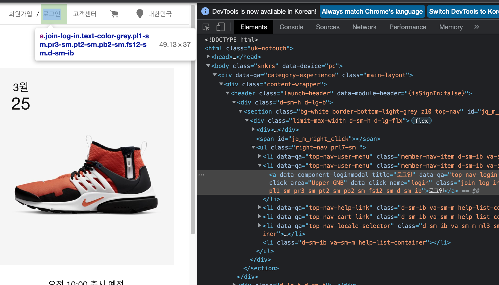
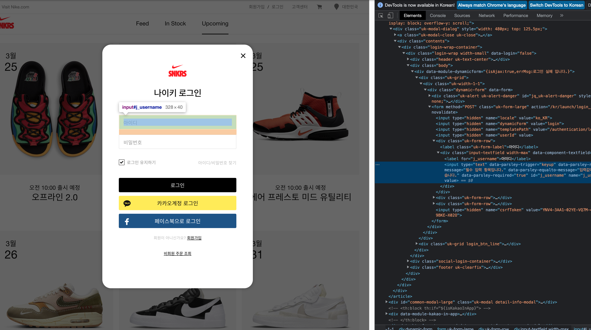

## 셀레니움을 이용한 나이키 공홈 응모 자동화 만들기

---

### 셀레니움이란?

- 셀레니움은 파이어폭스, 인터넷 익스플로어, 크롬등과 같은 브라우저를 컨트롤 할 수 있게 해준다. 현재 파이썬 3.5 이상부터 지원되며 3.6 이상 버전 부터 pip 로 표준 라이브러리로 사용할 수 있다.

- ```python
  python3 -m pip install selenium
  ```

  위 명령어를 통해 설치 가능하다.

- 셀레니움을 사용하기 위해서는 크롬드라이버(크롬브라우저를 컨트롤 할 수 있도록 해주는 파일)를 다운로드해야한다.

- 자신이 사용하고 있는 크롬의 버전을 확인하고 그에 맞는 크롬드라이버를 받아야한다.

- 하지만 추후를 대비한다면(크롬 업데이트), 자신의 크롬 버전에 맞는 드라이버를 자동으로 설치하고 사용할 수 있도록 자동화를 하는게 좋다.

- 크롬 드라이버를 자동으로 설치해주는 라이브러리를 설치해보자

- ```python
  python3 -m pip install chromedriver-autoinstaller
  ```

- ```python
  # 셀레니움을 실행하는 명령어는 기본적으로 아래처럼 사용한다.
  from selenium import webdriver
  import chromedriver_autoinstaller
  from selenium.webdriver.chrome.service import Service
  
  chrome_ver = chromedriver_autoinstaller.get_chrome_version().split('.')[0]  
  # chromedriver_autoinstaller.get_chrome_version() 을 사용하면 현재 내 크롬 버전을 string으로 return한다.
  service = Service(f'./{chrome_ver}/chromedriver')
  # 웹 드라이버를 열 때 경로를 지정해주는 방법에서 sevice 객체를 지정해 넘겨주는 방식을 권장하도록 바뀌었다. 따라서 위처럼 드라이버가 위치된 경로를 지정해준다.
  # f'{}' 는 파이썬 문자열 포맷팅 방법이다.
  
  try:
      driver = webdriver.Chrome(service=service)  
  except:
      chromedriver_autoinstaller.install(True)
      # 괄호 안을 True 라고 적으면 현재 파이썬 파일이 있는 곳에 크롬 버전을 폴더 이름으로 하여 크롬드라이버가 그 안에 저장된다.
      # 괄호 안을 False(default 값) 라고 적으면 site-packages\chromedriver_autoinstaller 폴더에 크롬 버전을 폴더명으로 하여 크롬드라이버가 그 안에 설치된다. (which python3 으로 python3 이 저장된 위치를 알 수 있다.)
      driver = webdriver.Chrome(service=service)
  
  driver.implicitly_wait(10)
  # 추후 설명
  ```
  
  - certificate 관련 에러가 뜨는 경우에는 Python이 설치된 폴더에서 Install Certificates.command 파일을 실행해주자.

---

### 셀레니움 wait과 sleep

- 명령어를 실행하고 서버에서 데이터를 받아오는 과정동안 대기시간이 필요하다.

- 예를 들면 driver.get('https://www.naver.com') 명령어를 실행하자마자 데이터를 전부 받아오기도 전에 다음 명령어를 진행하면 코드가 제대로 동작하지 않는다.

- 이를 위해 implicitly wait(웹 페이지 전체 로딩까지 기다리기)와 explicity wait(웹 페이지 일부 로딩까지 기다리기)가 있다.

- wait 이외에 시간을 기다리르 명령어가 있다.

  - import time
  - time.sleep(10)
  - 10초간 기다린다.

- ```python
  from selenium import webdriver
  from selenium.webdriver.chrome.service import Service
  
  service = Service(f'./{chrome_ver}/chromedriver')
  driver = webdriver.Chrome(service=service)
  driver.implicitly_wait(5)
  ```
  
- 위 명령어는 웹 페이지가 전부 로딩 될 때까지 기다리겠다는 뜻이고, 5초 이후에는 로딩이 전부 안 되었어도 다음 명령어를 실행한다.

- 무조건 5초를 기다리려면 time.sleep(5)를 쓰자.

- explicitly wait는 내가 접근하고자 하는 부분이 표시될 때 까지 기다린다.

- 웹 페이지가 항상 데이터를 다 불러왔다고 해서 화면에 딱 하고 표시되는 것이 아니다.

- 예를들면 자바스크립트로 짜여진 코드 부분이 렌더링되는 시간이 있다.

- 즉, 데이터를 모두 받아왔어도 동적으로 HTML구조가 변하는 경우라고 이해하자.

- ```python
  from selenium import webdriver
  from selenium.webdriver.chrome.service import Service
  from selenium.webdriver.common.by import By
  from selenium.webdriver.support.ui import WebDriverWait
  from selenium.webdriver.support import expected_conditions as EC
  
  service = Service(f'./{chrome_ver}/chromedriver')
  driver = webdriver.Chrome(service=service)
  driver.get("https://www.naver.com")
  
  element = WebDriverWait(driver, 10).until(EC.presence_of_element_located((By.ID, "idname")))
  ```
  
- import 부분은 그냥 넘어가자. 그냥 explicitly wait를 사용하기 위한 것들이다...

- 마지막 줄만 자세히 보면 된다.

- WebDriverWait(driver, 5) 명령어는 5초까지 내가 필요한 부분이 나타날 때 까지 기다려보는 것이다.

- 물론 그 전에 나타나면 다음으로 진행한다.

- EC.presence_of_element_located((By.ID, "idname"))

  - 괄호안의 요소가 나타날 때 까지 기다리라는 의미이다.
  - 요소는 보통 아래와 같이 사용한다.
    - (By.ID, "아이디이름")
    - (By.CLASS_NAME, ‘클래스명’)
    - (By.XPATH, ‘xpath경로’)
    - (By.NAME, ‘네임명’)
    - (By.CSS_SELECTOR, ‘CSS셀렉터’)
    - (By.PARTIAL_LINK_TEXT, ‘링크텍스트일부분’)
    - (By.LINK_TEXT, ‘링크텍스트(전부일치)’)

- EC 안에는 요소가 나타날 때 까지 말고도, 클릭 가능할 때 까지 등등 많지만 보통
- EC.element_to_be_clickable 과 위 두개를 많이 사용한다.

---

### 본격적으로 웹 사이트 조종해보기

- 먼저 로그인을 해보자 그러려면 로그인 버튼에 접근해야 한다.
- 보통 xpath를 사용하여 접근한다.
- 크롬 개발자도구를 사용해서 우클릭해서 copy xpath를 하면 된다...
- 

```python
driver.find_element_by_xpath('//*[@id="jq_m_right_click"]/div/ul/li[2]/a').click()
# 괄호 안에 붙여넣기 하면 끝이다.. 뒤에 .click() 함수가 붙으면 말 그대로 해당 요소를 클릭한다.
```

- 

- 위와 같이 로그인 창은 자바스크립트가 렌더링 되어 뜨는데, 이런 경우 아이디와 비밀번호 입력 폼에 접근할 수 있을 때까지 기다려주어야한다. 즉, explicitly wait를 이용한다.

```python
WebDriverWait(driver, 15).until(
        EC.element_to_be_clickable((By.XPATH, '//*[@id="j_username"]'))).send_keys("wty8798")
```

- 개발자 도구를 보면 아이디 폼에 아이디를 입력받아서 j_username을 보내줘야한다.
- XPATH 말고도 CSS_SELECTOR 등으로 접근 가능하다.
- 이런 식으로 비밀번호까지 채운 후에 로그인버튼을 클릭하면 로그인은 완성이다.
- 하지만 로그인을 클릭하면 에러페이지가 뜬다.
- 나이키에서 셀레니움을 사용해 페이지에 접근한 경우 접속을 거부한 것이다.

---

### 일반 크롬과 똑같은 설정으로 셀레니움 실행시키기

```python
from selenium import webdriver
from selenium.webdriver.chrome.service import Service
from selenium.webdriver.chrome.options import Options
import chromedriver_autoinstaller
import subprocess

subprocess.Popen('/Applications/Google\ Chrome.app/Contents/MacOS/Google\ chrome --remote-debugging-port=9222 --user-data-dir="/Users/wetaeyoung/Desktop/abc/ccfiles"', shell=True)

# 쉘 명령어를 파이썬에서 실행시키려면 subprocess.Popen() 안에 쉘 명령어를 적어준다
# 크롬 브라우저를 실행하는 명령어이다. 실제 크롬이 설치된 경로를 적어주고,
# 뒤의 옵션은 9222번 포트에서 실행시킨다는 것이다.
# 일반 크롬과 같게 하기 위해 쿠키와 캐쉬를 저장할 곳의 경로도 적어준다. 일반 셀레니움은 쿠키와 캐쉬를 저장하지 않는다.

service = Service(f'./{chrome_ver}/chromedriver')
option = Options()
option.add_experimental_option("debuggerAddress", "127.0.0.1:9222")
# 앞으로 조작할 크롬을 9222번 포트에 연결되어 있는 크롬으로 사용하겠다는 뜻

chrome_ver = chromedriver_autoinstaller.get_chrome_version().split('.')[0]
try:
    driver = webdriver.Chrome(service=service, options=option)
except:
    chromedriver_autoinstaller.install(True)
    driver = webdriver.Chrome(service=service, options=option)

driver.implicitly_wait(10)
```

- 필요에 의해 쿠키를 삭제해야 한다면, 파이썬에서 제공하는 shutil 모듈을 사용해보자.
- shutil.rmtree(폴더경로) 를 사용하면 된다.

---

### 응모하기

- 로그인이 정상적으로 동작하므로 응모가 진행 중인 상품을 클릭하고 사이즈 선택 및 응모완료를 하면 된다.

- 응모 진행 중인 상품이 여러개 일 수 있다.

- ```python
  now_drawing = driver.find_elements_by_xpath("//*[contains(text(),'Coming Soon')]")
  ```

- '응모' 이라는 텍스트를 가진 요소들을 찾은 뒤 리스트로 반환해준다.

- 따라서 아래처럼 코드를 짜면 모든 요소들을 클릭할 수 있다.

- ```python
  for product in now_drawing :
          product.click()
  ```

---

### 
